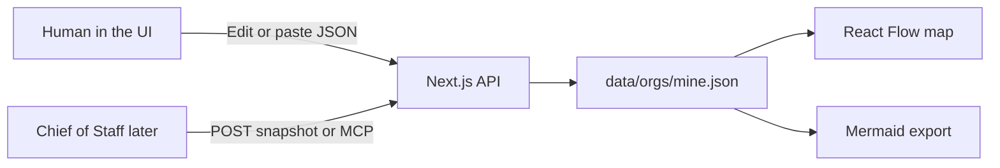

# Architecture

Eye of Grok is a **readout** of a Grok Bot account, not a second control plane. Humans (or a Chief of Staff Bot) write a graph. The site draws it. It does not hide or delete real Bots.

## Why this exists

Grok Bot scales like a company: up to **50 Bots + group chats**, **2–6 Bots per group**, per-Bot memory, a shared computer, hidden Bots that still run routines. xAI left coordination to a Chief of Staff and did not ship an org dashboard. There is **no official roster API**.

This app is the map you wish the sidebar was.

## MVP now vs later

| Now | Parked |
| --- | --- |
| Interactive org map (React Flow) | Grok 4.6 analyze / lean-up (code exists, UI hidden) |
| Edit your bots and spaces in the browser | Live import from the Grok Bot macOS app |
| Status colors + “Flag stale” | Hide/delete against real Grok Bot |
| Mermaid export | Multi-tenant / many humans |
| REST + MCP ingest | xAI key |

Default org id is `mine`. Starter graph is just **Logan**. Add the real roster from **Edit**.

## Data model (source of truth)

JSON snapshot, not Mermaid. Schema: [`src/lib/types.ts`](src/lib/types.ts), Zod: [`src/lib/schema.ts`](src/lib/schema.ts).

```ts
type OrgSnapshot = {
  orgId: string;
  pushedAt: string;
  source: "chief_of_staff" | "manual" | "fixture";
  nodes: Array<{
    id: string;
    kind: "bot" | "group" | "human";
    name: string;
    title?: string;
    status: "active" | "stale" | "hidden" | "deprecated" | "duplicate";
    lastActiveAt?: string;
    notes?: string;
  }>;
  edges: Array<{
    id: string;
    from: string;
    to: string;
    kind: "reports_to" | "member_of" | "handoff" | "shares_context";
  }>;
};
```

- **bot** — a Grok Bot (own memory, own routines).
- **group** — a group chat / space (shared project context).
- **human** — you. Judgment, not dispatcher.
- **reports_to** — org line (specialist → Chief of Staff → you).
- **member_of** — bot → space.
- **handoff** — async bot-to-bot work.
- **shares_context** — overlapping knowledge, not membership.

Do not store transcripts or raw memory.

## How a request flows



Local snapshots live under `data/orgs/` (gitignored). First `GET /api/orgs/mine` seeds [`src/lib/my-setup.ts`](src/lib/my-setup.ts).

Writes to `POST /api/orgs/:id/snapshot` and MCP need `Authorization: Bearer <INGEST_TOKEN>` (default `hackathon-demo`).

## File map

| Path | Role |
| --- | --- |
| `src/app/page.tsx` | Loads `mine` and renders the map |
| `src/components/OrgWorkbench.tsx` | Map, inspect, edit, mermaid, connect |
| `src/components/OrgNode.tsx` | Node card |
| `src/lib/layout-graph.ts` | dagre layout for React Flow |
| `src/lib/graph-edit.ts` | Add/remove nodes and links |
| `src/lib/mermaid.ts` | Snapshot → flowchart |
| `src/lib/store.ts` | File-backed store |
| `src/lib/fixture.ts` | Old messy-startup sample (unused in UI) |
| `src/lib/analyze.ts` | Parked Grok / heuristic lean-up |
| `src/app/api/orgs/[id]/*` | REST |
| `src/app/api/mcp/route.ts` | Streamable HTTP MCP |
| `src/lib/mcp-server.ts` | `push_org_snapshot`, `get_org_view`, `analyze_org` |

## Product rules we are not breaking

- Hide ≠ pause (routines still run).
- Delete ≠ wipe the shared computer.
- Duplicate copies profile, not memory.
- Tools/computer are account-level; memory is per Bot.
- The map is a **claimed** org. If the Chief of Staff never saw a hidden Bot, it will not appear.
- Never auto-delete a real Bot from this app.

## Stack

Next.js 16 App Router, React 19, Tailwind 4, `@xyflow/react`, `@dagrejs/dagre`, `mermaid`, `zod`, `@modelcontextprotocol/sdk`. Node 22+ (dev is 26 here). No Supabase. No xAI key for the visualizer MVP.

## Later (analyzer)

`POST /api/orgs/mine/analyze` calls Grok 4.6 when `XAI_API_KEY` or `GROK_API_KEY` is set, else a heuristic. Recommendations must cite existing node ids. UI entry point was removed on purpose.
