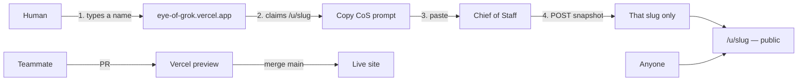
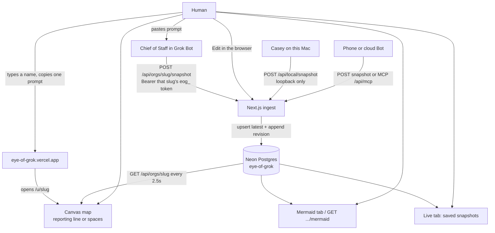

# Eye of Grok

A **human-facing org map** for a Grok Bot account. The Chief of Staff (Casey, or a cartographer Bot) pushes the roster. People **see** the company and **judge** a lean-up plan. Nothing in this app hides or deletes a real Bot.

Repo: [github.com/supe-log/eye-of-grok](https://github.com/supe-log/eye-of-grok)  
Live: [https://eye-of-grok.vercel.app](https://eye-of-grok.vercel.app)

This is the gap xAI left on purpose. In [Designing Grok Bot](https://x.ai/news/designing-grok-bot) they considered dashboards and assignment boards, then dropped them so the **user would not become the dispatcher**. Coordinating Bots own routing. The problem that remains: the human still cannot *see* the company as it grows.

- **How it works (end to end):** [claim → CoS → map, and PR → main → deploy](#how-it-works-end-to-end)
- **Full overview:** [OVERVIEW.md](OVERVIEW.md)
- Architecture: [ARCHITECTURE.md](ARCHITECTURE.md)
- Teammates (clone / push): [TEAM.md](TEAM.md)
- Demo walkthrough: [DEMO.md](DEMO.md)

Grok Bot scales like a company:

- Up to **50 Bots + group chats** combined
- **2–6 Bots per group**
- Per-Bot memory, **shared** computer
- Hidden Bots that **still run routines**
- **No official roster API**

Eye of Grok is the map you wish the sidebar was: a readout + recommendation surface the Chief of Staff writes to — not a second control plane.

## How it works (end to end)

Read this first. A new teammate should be able to explain both loops without asking Logan.

**Maps are public by default.** Anyone can open `/u/<slug>` and see bots, jobs, and rooms. That is setup only — low risk. The write secret stays in the Chief of Staff prompt (`Authorization: Bearer …`). Do not put that token in client JS except the copy-prompt box.



### Product loop (humans + Chief of Staff)

1. Open [https://eye-of-grok.vercel.app](https://eye-of-grok.vercel.app).
2. Type a name. That **claims a slug** (`logan` → `/u/logan`). If the slug is taken, the page offers `logan1`, `logan2`, and so on.
3. Click **Copy Chief of Staff message**. The prompt includes **that slug’s** POST URL (`/api/orgs/<slug>/snapshot`) and a **unique write token**.
4. Paste the message into that account’s Grok Bot Chief of Staff.
5. The CoS builds an `OrgSnapshot` from the sidebar: bots, groups, `reports_to`, statuses. No transcripts, memory text, or keys.
6. The CoS POSTs. **Only that slug’s map** updates.
7. Anyone opens `/u/<slug>` (public read) and sees the layout. The home page also has a gallery of other public fleets.
8. Re-push whenever the fleet changes. The map shows `pushedAt`.

Logan’s demo stays at `/u/mine`. New people claim their own slug. They do not all write to `mine`.

### Ship UI loop (teammates)

1. Repo: [https://github.com/supe-log/eye-of-grok](https://github.com/supe-log/eye-of-grok). Default branch is **`main`**.
2. Push a PR. You get a Vercel preview **when GitHub is linked** in the Vercel project.
3. Merge to **`main`**. That is the production deploy to the live site. Production Branch = `main` once the GitHub repo is connected in Vercel.
4. Local UI work: `npm i && npm run dev`. Do not commit secrets, `.env.local`, or `data/`.

More clone / push notes: [TEAM.md](TEAM.md). This-Mac Casey ingest: [LOCAL.md](LOCAL.md).



How it works today: a person claims a slug, the Chief of Staff pushes a JSON roster, Neon keeps the latest map plus a revision on every save, and the public page draws a canvas-style DAG (Mermaid is an export, not the source of truth). Analyze / Grok 4.6 is parked and is not on this path.

---

## What we are trying to build

One page. Three layers on the **same** graph.

1. **Org / spaces** — you at the top, Chief of Staff, specialists, group chats as clusters. Click a node for role, status, memberships.
2. **Hygiene** — flag `stale` / `hidden` / `deprecated` / `duplicate`, plus groups over the 6-Bot cap. Surface `bots + groups / 50`.
3. **Onboarding** — “If you are new, talk to X for Y.” Derived from `reports_to` + titles, optionally rewritten by Grok 4.6.

The Chief of Staff (or a human) fills a small JSON graph from what it can see. The site stores that snapshot, draws a canvas-style DAG, and can export Mermaid so the same picture pastes into a chat or doc.

**Mermaid is a view, not the source of truth.** Flowcharts get ugly past ~20–30 nodes. We store a graph and render it two ways.

### Why a Bot has to push (there is no import)

There is no official API to list Bots, groups, handoffs, or memory. Official docs cover create / edit / hide / delete **in the app**, not a developer export. Encrypted macOS app data is not imported. Unofficial CLIs and session files are out of scope.

Until xAI ships a roster API, every live picture is **Bot as cartographer**: names, titles, statuses, memberships — never transcripts or raw memory.

| Door | When to use | Keys |
| --- | --- | --- |
| **Edit** in the browser | You type the sidebar | That org's write token (loopback can skip it) |
| **Local POST** `http://127.0.0.1:3002/api/local/snapshot` | Casey on **this Mac** (local egress) | None — always writes Logan's `mine` |
| **Bearer POST** `/api/orgs/<slug>/snapshot` | Bot or human off this laptop | **That org's** ingest token + a **public HTTPS** site |
| **MCP** `/api/mcp` | Same handlers, remote Bot | **That org's** ingest token + public HTTPS. Cloud MCP **cannot** see localhost |

---

## Now vs the full architecture

| Built now | In the architecture, not on by default |
| --- | --- |
| Canvas-style map (reporting line / spaces), inspect, **Flag stale** | Grok 4.6 analyze UI (keep / hide / merge / close-group + onboarding blurb) — **API exists**, UI hidden until we have an xAI key and the team turns it on |
| Edit the roster in the browser | Official “list my bots” import (does not exist) |
| Live local ingest from Casey on this Mac | Auto-read `~/Library/Application Support/Grok Bot` |
| Mermaid export of the current graph | Lean “after” Mermaid from analyze |
| REST + MCP ingest, per-slug claim + unique write tokens | Hide / delete against real Grok Bot |
| Capacity gauges (`/50`, over-cap spaces) | Daily routine that re-pushes from Grok Bot |
| Durable Neon snapshots + revision history per slug | Multi-tenant / many humans on one map |

Default demo org id is `mine`. First paint of `/u/mine` is **Logan May's real Grok Bot layout** from this Mac: Log (Chief of Staff), sidebar sections (GT, Harness, Factory, Ops, Writing App, Personal), 21 bots, and 11 group rooms. Everyone else claims their own slug. Casey can POST a newer snapshot any time.

---

## Share a public map with any Grok Bot

The full claim → CoS → map loop (and how a PR ships) is in [How it works (end to end)](#how-it-works-end-to-end). Short version:

1. Open [https://eye-of-grok.vercel.app](https://eye-of-grok.vercel.app) and type your name.
2. Claim a slug (`logan` → `/u/logan`). If that slug is taken, the page offers `logan1`, `logan2`, …
3. **Copy Chief of Staff message** embeds **that slug's** ingest URL (`POST /api/orgs/<slug>/snapshot`) and a unique write token.
4. Paste it into that account's Chief of Staff. The Bot POSTs bots, jobs, and rooms.
5. Only `/u/<slug>` fills in. Anyone can open it — maps are **public to read**. The token is the only write secret.

No xAI key. No Grok Bot login. The Bot is the cartographer. Rotate a leaked token with `POST /api/orgs/<slug>/rotate` and the current bearer.

Logan May's demo roster stays at `/u/mine`. New people claim their own slug — they do not write to `mine`. Home has a public gallery (slug, display name or “Anonymous layout”, bot/room counts, last push).

### Reproduce this on a public site (under 10 steps)

1. Deploy to Vercel. Set `DATABASE_URL` (Neon), `NEXT_PUBLIC_APP_URL`, and `INGEST_TOKEN` (Logan's `mine` only).
2. Open the site. Type your name.
3. Click **Copy Chief of Staff message** (claims `/u/<slug>` and reveals `eog_…`).
4. Paste that message into your Chief of Staff.
5. Open `/u/<slug>`. The map fills when the Bot POSTs.
6. Confirm a POST with the wrong or missing bearer is rejected.
7. Confirm `/u/mine` still loads Logan's demo.
8. Confirm `GET /api/health` shows `store.driver: "neon"` and `store.durable: true`.
9. If the token leaks, `POST /api/orgs/<slug>/rotate` with the current bearer.
10. Local Mac demos: `npm run dev` + `POST /api/local/snapshot` — no bearer, still `mine`. See [LOCAL.md](LOCAL.md).

## Run

```bash
git clone https://github.com/supe-log/eye-of-grok.git
cd eye-of-grok
npm install
npm run dev
```

On Logan's Mac the app is already bound to **[http://localhost:3002](http://localhost:3002)** (3000 was taken). Home is the share page. Demo map: [http://localhost:3002/u/mine](http://localhost:3002/u/mine).

After deploy, set `NEXT_PUBLIC_APP_URL` to the public origin so prompts print the right host.

**Live tab → Copy Casey prompt** (this Mac, loopback, no bearer) and paste it into Casey. The map polls `GET /api/orgs/<slug>` every 2.5s and redraws.

90-second walkthrough: [DEMO.md](DEMO.md). This-Mac ingest: [LOCAL.md](LOCAL.md). Teammates: [TEAM.md](TEAM.md). File-level architecture: [ARCHITECTURE.md](ARCHITECTURE.md).

---

## Keys and setup (exactly)

The **map does not need any vendor key.** Do not send xAI, Cursor, or Grok Bot session secrets to make the picture show.

| Variable | Required to see the map? | What it is for |
| --- | --- | --- |
| *(nothing)* | No | Local site + Edit + Casey POST to loopback |
| `INGEST_TOKEN` | Only Logan's `/u/mine` off-machine writes | Bearer for `POST /api/orgs/mine/snapshot` and MCP writes scoped to `mine`. Local default: `hackathon-demo`. Not used for other slugs. |
| `DATABASE_URL` | Production persistence | Neon Postgres. Latest snapshot + a revision row on every save. Local fallback without it is `data/` (gitignored). |
| `BLOB_READ_WRITE_TOKEN` | Optional secondary | Used only if Neon is unset. Prefer `DATABASE_URL`. |
| `NEXT_PUBLIC_APP_URL` | Public prompts | Origin printed in CoS messages after deploy |
| `XAI_API_KEY` or `GROK_API_KEY` | No | Parked analyze pass (`POST /api/orgs/:id/analyze`, Grok 4.6). Without it, a heuristic still runs if something calls that route |
| `GROK_MODEL` / `XAI_BASE_URL` | No | Optional analyze overrides. Defaults in `.env.example` |
| `CURSOR_API_KEY` | No | Not this app |

Claimed orgs mint their own `eog_…` token. The server stores only a SHA-256 hash. The home-page copy prompt is the one-time reveal (also saved in this browser's `localStorage`). Public `GET /api/share/:orgId` never returns a token unless you send that org's bearer.

Loopback POSTs to `/api/local/snapshot` still need no token and still write `mine`. See [LOCAL.md](LOCAL.md).

Copy `.env.example` → `.env.local` to set `INGEST_TOKEN`, `DATABASE_URL`, or analyze keys.

**Do you need a live public website?**

- **Logan + Casey on this laptop:** no. `npm run dev` on :3002 is the live picture. Loopback ingest is unchanged.
- **Anyone else, a phone, or a Bot whose tools run only in the cloud:** yes. Deploy (e.g. Vercel), set `DATABASE_URL`, `INGEST_TOKEN` for `/u/mine`, and `NEXT_PUBLIC_APP_URL`, then each person claims a slug.

Org maps persist in Neon Postgres (`org_snapshots` plus a revision row on every save). Leave and come back, or open the same slug from another device — the latest snapshot is still there. Local fallback without `DATABASE_URL` is still `data/orgs/` (gitignored). `GET /api/health` reports `{ store: { driver, durable } }`.

---

## Bot communication

One-way push. The site does not talk back into Grok Bot.

1. Casey lists every Bot and group it knows: name, title, status (`active` \| `stale` \| `hidden` \| `deprecated` \| `duplicate`), who they report to, which spaces they sit in.
2. Include Logan as `kind: "human"`.
3. POST that JSON. No transcripts, memory text, API keys, or file contents.
4. Eye of Grok replaces **that org's** snapshot and the map updates.

On this Mac, Grok Bot already has **local egress** and local tools allowed. Casey should POST to:

```http
POST http://127.0.0.1:3002/api/local/snapshot
Content-Type: application/json
```

No bearer on loopback. Prompt text: **Live** tab, or `GET http://127.0.0.1:3002/api/local/snapshot`.

**Do not** add `http://127.0.0.1:3002/api/mcp` as a remote MCP server. The Bot's MCP client runs in the cloud and cannot see localhost. grok.com connectors, Cursor `mcp.json`, and Grok Build `grok mcp` are different products.

---

## API

| Method | Path | Auth | What |
| --- | --- | --- | --- |
| POST | `/api/orgs/claim` | none (bearer optional to re-reveal) | Claim a slug, mint token, return CoS prompt |
| GET | `/api/orgs/:id` | no | Current map. `mine` seeds Logan if empty. Other slugs 404 until claimed |
| GET | `/api/orgs/:id?reset=1` | that org's bearer *or* loopback | Back to starter (Logan fixture for `mine`) |
| POST | `/api/local/snapshot` | loopback only | Replace Logan's `mine` graph (this Mac, no bearer) |
| GET | `/api/local/snapshot` | no | Casey loopback prompt + ingest URL |
| POST | `/api/orgs/:id/snapshot` | that org's bearer *or* loopback | Replace that org's graph |
| POST | `/api/orgs/:id/rotate` | current bearer | Mint a new token (not for `mine` — change `INGEST_TOKEN`) |
| GET | `/api/orgs/:id/mermaid` | no | Flowchart export |
| POST | `/api/orgs/:id/analyze` | no | Parked: keep / hide / merge / close-group + onboarding |
| GET | `/api/share/:id` | bearer to reveal token | Public URLs; prompt only if you already have the token |
| GET | `/api/health` | no | Store driver + whether persistence is durable |
| GET | `/api/gallery` | no | Public index: slug, label, bot/group counts, `pushedAt` (no tokens) |
| GET/POST | `/api/mcp` | that org's bearer on writes | `push_org_snapshot` is scoped to the bearer org |

MCP tools wrap the same handlers. Writes require a token that resolves to one org; `push_org_snapshot` cannot target a different org.

---

## Data model (canonical JSON)

Schema: [`src/lib/types.ts`](src/lib/types.ts), Zod: [`src/lib/schema.ts`](src/lib/schema.ts). Small enough that a Bot can fill it from memory of the roster.

```ts
type OrgSnapshot = {
  orgId: string;
  pushedAt: string;
  source: "chief_of_staff" | "manual" | "fixture";
  nodes: Array<{
    id: string;
    kind: "bot" | "group" | "human";
    name: string;
    title?: string;
    status: "active" | "stale" | "hidden" | "deprecated" | "duplicate";
    lastActiveAt?: string;
    notes?: string;
  }>;
  edges: Array<{
    id: string;
    from: string;
    to: string;
    kind: "reports_to" | "member_of" | "handoff" | "shares_context";
  }>;
};
```

| Kind / edge | Meaning |
| --- | --- |
| `bot` | A Grok Bot (own memory, own routines) |
| `group` | A group chat / space |
| `human` | You. Judgment, not dispatcher |
| `reports_to` | Org line (specialist → Chief of Staff → you) |
| `member_of` | Bot → space |
| `handoff` | Async bot-to-bot work |
| `shares_context` | Overlapping knowledge, not membership |

Each claimed org is `{ orgId, tokenHash, claimedAt, snapshot }`. Latest map and revisions live in Neon (`org_snapshots`). Without `DATABASE_URL`, local fallback is `data/orgs/` (gitignored).

---

## Product rules (do not break)

These are Grok Bot facts the UI must not lie about:

- **Hide ≠ pause.** Routines still run.
- **Delete ≠ wipe the shared computer.** Profile / conversation / routines go; files and logins can remain.
- **Duplicate copies profile, not memory.**
- Tools and the computer are **account-level**. Memory is **per Bot**.
- The map is a **claimed org**. If the Chief of Staff never saw a hidden Bot, it will not appear.
- **Never auto-delete** a real Bot from this app. Recommend hide / merge only.
- Analyze (when on) may only cite node ids that exist in the snapshot. Never invent Bots to remove.
- Do not ingest transcripts or raw memory.

A dashboard that becomes another thing to manage loses. Write-path stays with the Chief of Staff. The human stays in **judgment**, not dispatch.

---

## Shortcomings we already know

- **Data is always incomplete.** Hidden Bots, groups Casey is not in, and stale memory will be missing or wrong.
- **No official roster API.** Live integration is “Bot as cartographer,” not a sync.
- **Freshness.** A snapshot ages the moment someone creates a Bot in the app. We show `pushedAt`. A later stretch is a routine that re-pushes.
- **Grok can hallucinate cleanup.** That is why analyze is gated on the snapshot and parked in the UI.
- **MCP + localhost.** Cloud MCP cannot reach this laptop. Public HTTPS or local REST only.
- **Maps are per claimed slug, not a shared Bot team.** Grok Bot is still account-scoped. Each human has their own map and write token.

---

## Out of scope (this weekend)

Live hide/delete in Grok Bot, scraping the macOS app, unofficial CLIs, login/SSO, historical diffs, Agent SDK project layout, Granola / Slack sync.

Do not turn the Analyze UI back on unless someone adds an xAI key and the team agrees.

---

## Stack

Next.js 16 App Router, React 19, Tailwind 4, `@dagrejs/dagre`, `mermaid`, `zod`, `@modelcontextprotocol/sdk`, `@neondatabase/serverless`. Node 22+. No Supabase. No xAI key for the visualizer. Canvas-style DAG in the browser; Cursor canvas beside chat for the same roster.

---

## Docs

| Doc | What |
| --- | --- |
| [How it works (end to end)](#how-it-works-end-to-end) | Claim → CoS → map, and PR → `main` → deploy |
| [ARCHITECTURE.md](ARCHITECTURE.md) | File map, request flow, schema notes |
| [LOCAL.md](LOCAL.md) | This-Mac live ingest (Casey → :3002) |
| [DEMO.md](DEMO.md) | 90-second walkthrough |
| [TEAM.md](TEAM.md) | Clone, push, what not to do |
