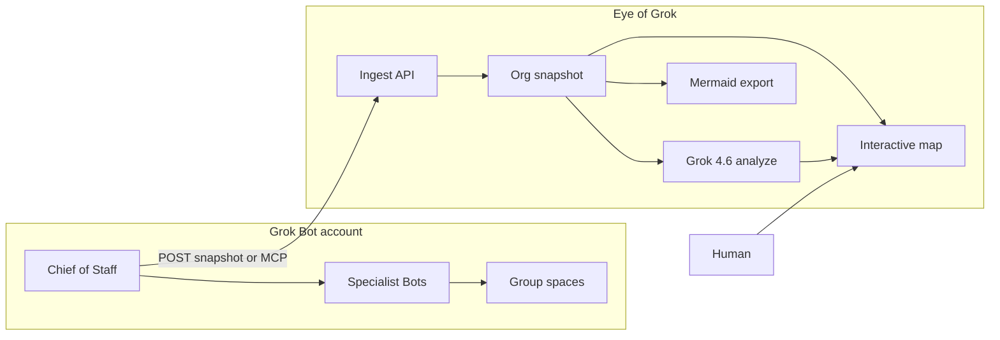

# Eye of Grok

A **human-facing org map** for a Grok Bot account. The Chief of Staff (Casey, or a cartographer Bot) pushes the roster. People **see** the company and **judge** a lean-up plan. Nothing in this app hides or deletes a real Bot.

Repo: [github.com/supe-log/eye-of-grok](https://github.com/supe-log/eye-of-grok)  
Live: [https://eye-of-grok.vercel.app](https://eye-of-grok.vercel.app)

This is the gap xAI left on purpose. In [Designing Grok Bot](https://x.ai/news/designing-grok-bot) they considered dashboards and assignment boards, then dropped them so the **user would not become the dispatcher**. Coordinating Bots own routing. The problem that remains: the human still cannot *see* the company as it grows.

- **Full overview (start here):** [OVERVIEW.md](OVERVIEW.md)
- Architecture: [ARCHITECTURE.md](ARCHITECTURE.md)
- Teammates (clone / push): [TEAM.md](TEAM.md)
- Demo walkthrough: [DEMO.md](DEMO.md)

Grok Bot scales like a company:

- Up to **50 Bots + group chats** combined
- **2–6 Bots per group**
- Per-Bot memory, **shared** computer
- Hidden Bots that **still run routines**
- **No official roster API**

Eye of Grok is the map you wish the sidebar was: a readout + recommendation surface the Chief of Staff writes to — not a second control plane.



---

## What we are trying to build

One page. Three layers on the **same** graph.

1. **Org / spaces** — you at the top, Chief of Staff, specialists, group chats as clusters. Click a node for role, status, memberships.
2. **Hygiene** — flag `stale` / `hidden` / `deprecated` / `duplicate`, plus groups over the 6-Bot cap. Surface `bots + groups / 50`.
3. **Onboarding** — “If you are new, talk to X for Y.” Derived from `reports_to` + titles, optionally rewritten by Grok 4.6.

The Chief of Staff (or a human) fills a small JSON graph from what it can see. The site stores that snapshot, draws a canvas-style DAG, and can export Mermaid so the same picture pastes into a chat or doc.

**Mermaid is a view, not the source of truth.** Flowcharts get ugly past ~20–30 nodes. We store a graph and render it two ways.

### Why a Bot has to push (there is no import)

There is no official API to list Bots, groups, handoffs, or memory. Official docs cover create / edit / hide / delete **in the app**, not a developer export. Encrypted macOS app data is not imported. Unofficial CLIs and session files are out of scope.

Until xAI ships a roster API, every live picture is **Bot as cartographer**: names, titles, statuses, memberships — never transcripts or raw memory.

| Door | When to use | Keys |
| --- | --- | --- |
| **Edit** in the browser | You type the sidebar | None |
| **Local POST** `http://127.0.0.1:3002/api/local/snapshot` | Casey on **this Mac** (local egress) | None |
| **Bearer POST** `/api/orgs/mine/snapshot` | Bot or human off this laptop | `INGEST_TOKEN` + a **public HTTPS** site |
| **MCP** `/api/mcp` | Same handlers, remote Bot | `INGEST_TOKEN` + public HTTPS. Cloud MCP **cannot** see localhost |

---

## Now vs the full architecture

| Built now | In the architecture, not on by default |
| --- | --- |
| Canvas-style map (reporting line / spaces), inspect, **Flag stale** | Grok 4.6 analyze UI (keep / hide / merge / close-group + onboarding blurb) — **API exists**, UI hidden until we have an xAI key and the team turns it on |
| Edit the roster in the browser | Official “list my bots” import (does not exist) |
| Live local ingest from Casey on this Mac | Auto-read `~/Library/Application Support/Grok Bot` |
| Mermaid export of the current graph | Lean “after” Mermaid from analyze |
| REST + MCP ingest | Hide / delete against real Grok Bot |
| Capacity gauges (`/50`, over-cap spaces) | Multi-tenant / many humans on one map |
| File store `data/orgs/mine.json` | Daily routine that re-pushes; historical diffs |

Default org id is `mine`. First paint is **Logan May's real Grok Bot layout** from this Mac: Log (Chief of Staff), sidebar sections (GT, Harness, Factory, Ops, Writing App, Personal), 21 bots, and 11 group rooms. Casey can POST a newer snapshot any time.

---

## Share a public map with any Grok Bot

This is the product: one website, many orgs. A person claims a slug, copies a prompt, and pastes it into their Chief of Staff — on a phone or a desktop.

1. Open [https://eye-of-grok.vercel.app](https://eye-of-grok.vercel.app) and type your name.
2. **Copy Chief of Staff message** and paste it into that account's Chief of Staff.
3. Open `/u/<slug>`. The map redraws when the Bot POSTs bots, groups, statuses, and tool names.

No xAI key. No Grok Bot login. The Bot is the cartographer.

Logan May's demo roster stays at `/u/mine`.

## Run

```bash
git clone https://github.com/supe-log/eye-of-grok.git
cd eye-of-grok
npm install
npm run dev
```

On Logan's Mac the app is already bound to **[http://localhost:3002](http://localhost:3002)** (3000 was taken). Home is the share page. Demo map: [http://localhost:3002/u/mine](http://localhost:3002/u/mine).

After deploy, set `NEXT_PUBLIC_APP_URL` to the public origin so prompts print the right host.

**Live tab → Copy Casey prompt** and paste it into Casey on this Mac. The map polls `GET /api/orgs/mine` every 2.5s and redraws.

90-second walkthrough: [DEMO.md](DEMO.md). This-Mac ingest: [LOCAL.md](LOCAL.md). Teammates: [TEAM.md](TEAM.md). File-level architecture: [ARCHITECTURE.md](ARCHITECTURE.md).

---

## Keys and setup (exactly)

The **map does not need any vendor key.** Do not send xAI, Cursor, or Grok Bot session secrets to make the picture show.

| Variable | Required to see the map? | What it is for |
| --- | --- | --- |
| *(nothing)* | No | Local site + Edit + Casey POST to loopback |
| `INGEST_TOKEN` | Only off-machine writes | Bearer for `POST /api/orgs/:id/snapshot` and MCP tools that write. Local default: `hackathon-demo` |
| `XAI_API_KEY` or `GROK_API_KEY` | No | Parked analyze pass (`POST /api/orgs/mine/analyze`, Grok 4.6). Without it, a heuristic still runs if something calls that route |
| `GROK_MODEL` / `XAI_BASE_URL` | No | Optional analyze overrides. Defaults in `.env.example` |
| `CURSOR_API_KEY` | No | Not this app |

There is **no `.env.local` yet.** The write token is `INGEST_TOKEN`, default `hackathon-demo`, defined in [`.env.example`](.env.example) and applied in [`src/lib/auth.ts`](src/lib/auth.ts). Loopback POSTs do not need it. Phone / cloud POSTs do. See [LOCAL.md](LOCAL.md).

Copy `.env.example` → `.env.local` only if you are turning analyze on or changing the ingest token.

**Do you need a live public website?**

- **Logan + Casey on this laptop:** no. `npm run dev` on :3002 is the live picture.
- **Teammates, a phone, or a Bot whose tools run only in the cloud:** yes. Deploy (e.g. Vercel), set `INGEST_TOKEN`, then Casey POSTs to `https://<host>/api/orgs/mine/snapshot` with `Authorization: Bearer <token>`, or uses MCP at `https://<host>/api/mcp`.

Vercel serverless will lose the file-backed snapshot across instances unless we add a real store later. Fine for a demo process; not a production multi-instance store.

---

## Bot communication

One-way push. The site does not talk back into Grok Bot.

1. Casey lists every Bot and group it knows: name, title, status (`active` \| `stale` \| `hidden` \| `deprecated` \| `duplicate`), who they report to, which spaces they sit in.
2. Include Logan as `kind: "human"`.
3. POST that JSON. No transcripts, memory text, API keys, or file contents.
4. Eye of Grok replaces `mine` and the map updates.

On this Mac, Grok Bot already has **local egress** and local tools allowed. Casey should POST to:

```http
POST http://127.0.0.1:3002/api/local/snapshot
Content-Type: application/json
```

No bearer on loopback. Prompt text: **Live** tab, or `GET http://127.0.0.1:3002/api/local/snapshot`.

**Do not** add `http://127.0.0.1:3002/api/mcp` as a remote MCP server. The Bot's MCP client runs in the cloud and cannot see localhost. grok.com connectors, Cursor `mcp.json`, and Grok Build `grok mcp` are different products.

---

## API

| Method | Path | Auth | What |
| --- | --- | --- | --- |
| GET | `/api/orgs/mine` | no | Current map (seeds Logan if empty) |
| GET | `/api/orgs/mine?reset=1` | no | Back to Logan-only starter |
| POST | `/api/local/snapshot` | loopback only | Replace Logan's graph (this Mac) |
| GET | `/api/local/snapshot` | no | Casey prompt + ingest URL |
| POST | `/api/orgs/mine/snapshot` | Bearer *or* loopback | Replace the graph from elsewhere |
| GET | `/api/orgs/mine/mermaid` | no | Flowchart export |
| POST | `/api/orgs/mine/analyze` | no | Parked: keep / hide / merge / close-group + onboarding |
| GET/POST | `/api/mcp` | Bearer on writes | `push_org_snapshot`, `get_org_view`, `analyze_org` — needs a public URL |

MCP tools wrap the same handlers. A public MCP without a token is an open write — use the bearer token off-loopback.

---

## Data model (canonical JSON)

Schema: [`src/lib/types.ts`](src/lib/types.ts), Zod: [`src/lib/schema.ts`](src/lib/schema.ts). Small enough that a Bot can fill it from memory of the roster.

```ts
type OrgSnapshot = {
  orgId: string;
  pushedAt: string;
  source: "chief_of_staff" | "manual" | "fixture";
  nodes: Array<{
    id: string;
    kind: "bot" | "group" | "human";
    name: string;
    title?: string;
    status: "active" | "stale" | "hidden" | "deprecated" | "duplicate";
    lastActiveAt?: string;
    notes?: string;
  }>;
  edges: Array<{
    id: string;
    from: string;
    to: string;
    kind: "reports_to" | "member_of" | "handoff" | "shares_context";
  }>;
};
```

| Kind / edge | Meaning |
| --- | --- |
| `bot` | A Grok Bot (own memory, own routines) |
| `group` | A group chat / space |
| `human` | You. Judgment, not dispatcher |
| `reports_to` | Org line (specialist → Chief of Staff → you) |
| `member_of` | Bot → space |
| `handoff` | Async bot-to-bot work |
| `shares_context` | Overlapping knowledge, not membership |

Snapshots live under `data/orgs/` (gitignored).

---

## Product rules (do not break)

These are Grok Bot facts the UI must not lie about:

- **Hide ≠ pause.** Routines still run.
- **Delete ≠ wipe the shared computer.** Profile / conversation / routines go; files and logins can remain.
- **Duplicate copies profile, not memory.**
- Tools and the computer are **account-level**. Memory is **per Bot**.
- The map is a **claimed org**. If the Chief of Staff never saw a hidden Bot, it will not appear.
- **Never auto-delete** a real Bot from this app. Recommend hide / merge only.
- Analyze (when on) may only cite node ids that exist in the snapshot. Never invent Bots to remove.
- Do not ingest transcripts or raw memory.

A dashboard that becomes another thing to manage loses. Write-path stays with the Chief of Staff. The human stays in **judgment**, not dispatch.

---

## Shortcomings we already know

- **Data is always incomplete.** Hidden Bots, groups Casey is not in, and stale memory will be missing or wrong.
- **No official roster API.** Live integration is “Bot as cartographer,” not a sync.
- **Freshness.** A snapshot ages the moment someone creates a Bot in the app. We show `pushedAt`. A later stretch is a routine that re-pushes.
- **Grok can hallucinate cleanup.** That is why analyze is gated on the snapshot and parked in the UI.
- **MCP + localhost.** Cloud MCP cannot reach this laptop. Public HTTPS or local REST only.
- **Not multi-tenant.** Grok Bot is account-scoped. Many humans sharing Bot teams is a different product.

---

## Out of scope (this weekend)

Live hide/delete in Grok Bot, scraping the macOS app, unofficial CLIs, full auth / multi-tenant, historical diffs, Agent SDK project layout, Granola / Slack sync.

Do not turn the Analyze UI back on unless someone adds an xAI key and the team agrees.

---

## Stack

Next.js 16 App Router, React 19, Tailwind 4, `@dagrejs/dagre`, `mermaid`, `zod`, `@modelcontextprotocol/sdk`. Node 22+. No Supabase. No xAI key for the visualizer. Canvas-style DAG in the browser; Cursor canvas beside chat for the same roster.

---

## Docs

| Doc | What |
| --- | --- |
| [ARCHITECTURE.md](ARCHITECTURE.md) | File map, request flow, schema notes |
| [LOCAL.md](LOCAL.md) | This-Mac live ingest (Casey → :3002) |
| [DEMO.md](DEMO.md) | 90-second walkthrough |
| [TEAM.md](TEAM.md) | Clone, push, what not to do |
